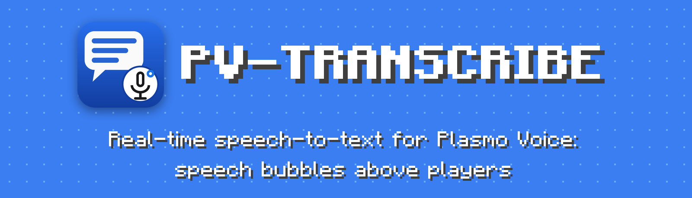
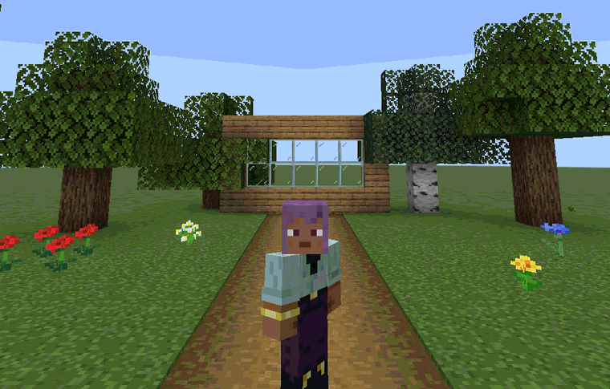
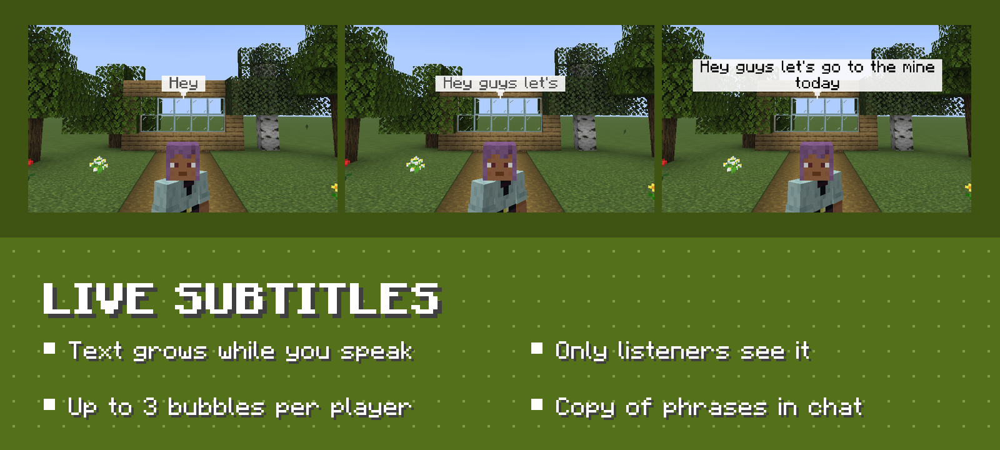
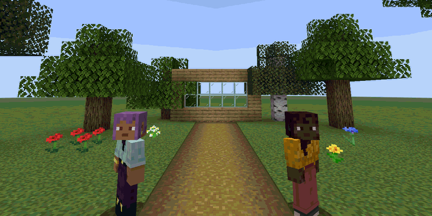
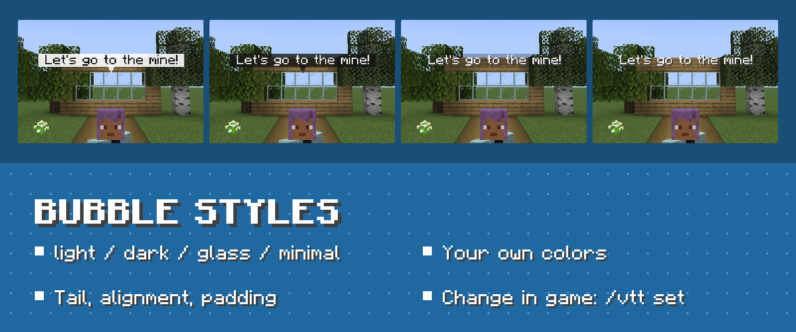
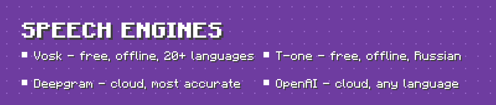
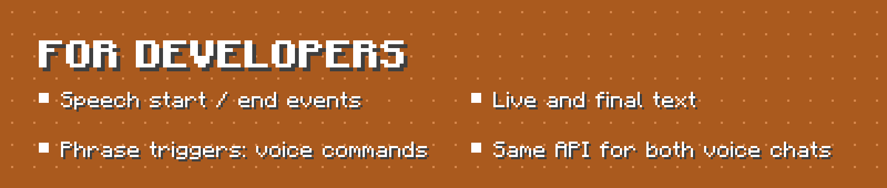
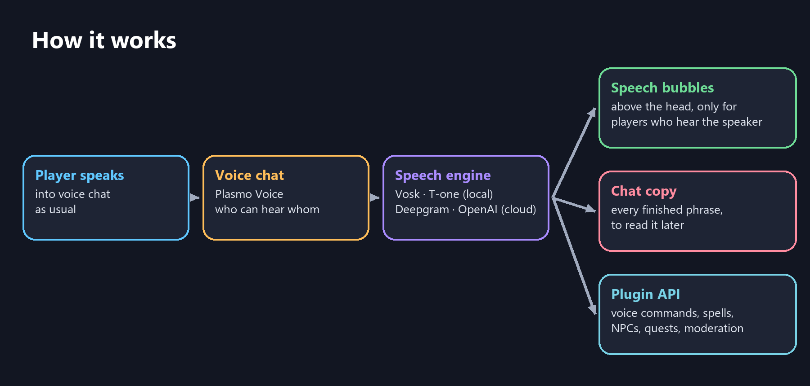

<a id="en"></a>

<div align="center">

🇬🇧 **English** · [🇷🇺 Русский — ниже](#ru)



[Releases](https://github.com/ArabKustam/Plasmo-Voice-Transcribe/releases) | [Modrinth](https://modrinth.com/plugin/pv-transcribe) | [Documentation](#configuration) | [API](#for-developers) | [Report a bug](https://github.com/ArabKustam/Plasmo-Voice-Transcribe/issues) | [🇷🇺 Русский](#ru)

[](https://github.com/ArabKustam/Plasmo-Voice-Transcribe/releases)
[](https://github.com/ArabKustam/Plasmo-Voice-Transcribe/actions)

[](LICENSE)

</div>

## See what people say in voice chat

Players talk in [Plasmo Voice](https://modrinth.com/plugin/plasmo-voice), and everyone who can hear them sees their words above their head. The text grows word by word while they speak. Players don't need any extra mod or resource pack.

<p align="center"></p>

## Features



<p align="center"></p>







Bubbles are shown only to players who can hear the speaker: proximity distance, [pv-addon-groups](https://modrinth.com/plugin/pv-addon-groups) and [pv-addon-broadcast](https://modrinth.com/plugin/pv-addon-broadcast).



## Requirements

| | |
|---|---|
| Server | Paper, Spigot or Purpur **1.20.2+**, tested on 1.21.8 |
| Java | 17 or newer |
| Voice chat | Plasmo Voice **2.1+** |
| Players | only the Plasmo Voice mod |
| First start | internet access: the server downloads libraries from Maven Central and the plugin downloads the speech model |

## Installation

1. Install Plasmo Voice on the server.
2. Download `PV-Transcribe-x.y.z.jar` from [Releases](https://github.com/ArabKustam/Plasmo-Voice-Transcribe/releases) (or Modrinth) into `plugins/`.
3. Start the server. The plugin picks a free local engine automatically.
4. Optional, for the best accuracy, use Deepgram:
   1. Create a key at [console.deepgram.com](https://console.deepgram.com).
   2. Put it into `engine.deepgram.api-key` in `plugins/PV-Transcribe/config.yml`.
   3. Run `/vtt reload` and `/vtt engine deepgram`.

## Commands

| Command | Description | Permission |
|---|---|---|
| `/vtt toggle` | Hide or show bubbles for yourself | `pvtranscribe.command.toggle` (everyone) |
| `/vtt status` | Engine state, load, dropped audio | `pvtranscribe.admin.status` |
| `/vtt reload` | Reload config and messages | `pvtranscribe.admin.reload` |
| `/vtt demo [player] [text]` | Show a demo bubble without a microphone (test styles, take screenshots) | `pvtranscribe.admin.demo` |
| `/vtt get [section]` | Show settings (API keys are masked) | `pvtranscribe.admin.config` |
| `/vtt set <option> <value>` | Change **any** config option in game; Tab completes options and values; saved to config.yml | `pvtranscribe.admin.config` |
| `/vtt engine <auto\|vosk\|t-one\|deepgram\|openai>` | Switch the speech engine live | `pvtranscribe.admin.engine` |
| `/vtt language <code\|auto>` | Recognition language, `auto` = detect | `pvtranscribe.admin.engine` |
| `/vtt player <name> <on\|off>` | Enable or disable transcription for a player | `pvtranscribe.admin.player` |
| `/vtt world <world> <on\|off>` | Enable or disable transcription in a world | `pvtranscribe.admin.world` |

More permissions:

| Permission | Default | Meaning |
|---|---|---|
| `pvtranscribe.see` | everyone | Sees bubbles |
| `pvtranscribe.transcribe` | everyone | Their speech is transcribed |
| `pvtranscribe.admin` | op | All admin commands |

## Configuration

Settings can be changed in two ways: edit [`config.yml`](platform-paper/src/main/resources/config.yml) and run `/vtt reload`, or change them in game with `/vtt set <option> <value>`, for example `/vtt set subtitles.style.preset dark`. Every option is documented in the config: language, engine and API keys, bubbles and their look, who sees them, timings, chat copy, number formatting, nickname matching, worlds, performance and debugging. Messages are in `plugins/PV-Transcribe/lang/` (English and Russian).

```yaml
subtitles:
  max-bubbles: 3
  max-words-per-bubble: 10
  style:
    preset: dark              # light, dark, glass, minimal
    background: "#C81E3A8A"   # #AARRGGBB
    final-format: "&f&l{text}"
    alignment: center
    padding: 2
    scale: 1.2
    tail:
      symbol: "▾"
```

> Minecraft draws text backgrounds as rectangles, so rounded corners would need a resource pack. Everything else works on an unmodified client.

## For developers

PV-Transcribe and [SVC-Transcribe](https://github.com/ArabKustam/Simple-Voice-Chat-Transcribe) (Simple Voice Chat) share the same API, so your plugin works with either voice chat without changes. Add the plugin jar as `compileOnly` and `softdepend: [PV-Transcribe, SVC-Transcribe]` to your `plugin.yml`.

```java
PVTranscribeApi api = PVTranscribe.get();

// Live and final text of every player
api.addListener(new TranscriptionListener() {
    @Override public void onSpeechStart(SpeechStartEvent e) { }
    @Override public void onPartialTranscript(Transcript t) { /* still speaking */ }
    @Override public void onFinalTranscript(Transcript t) { /* finished phrase */ }
    @Override public void onSpeechEnd(SpeechEndEvent e) { }
}, api.syncExecutor());

// Voice commands
api.phrases().register(PhraseTrigger.builder("magic:fireball")
        .phrases("fireball", "огненный шар")
        .mode(MatchMode.CONTAINS)
        .matchPartial(true)                // react before the sentence ends
        .executor(api.syncExecutor())      // main thread
        .handler(match -> {
            Player player = Bukkit.getPlayer(match.speakerId());
            if (player != null) player.launchProjectile(Fireball.class);
        })
        .build());

// Moderation: change or hide subtitle text
api.addSubtitleProcessor((transcript, text) -> text.replace("badword", "***"));
```

A `Transcript` has the speaker, `getText()`, `getRawText()`, `getNormalizedText()` (for matching), `isFinal()`, `getUtteranceId()`, the language, the voice source (`plasmovoice`) and the voice channel (`proximity`, `groups`, `broadcast`). Bukkit events are also fired on the main thread: `PlayerSpeechStartEvent`, `PlayerTranscriptEvent`, `PlayerSpeechEndEvent`.

## FAQ

**Which Minecraft versions?**
Paper, Spigot and Purpur 1.20.2 and newer (text displays appeared in 1.19.4, smooth movement in 1.20.2). Tested on 1.21.8.

**Does it work with Simple Voice Chat?**
Use [SVC-Transcribe](https://github.com/ArabKustam/Simple-Voice-Chat-Transcribe). Install only one of the two plugins.

**How accurate is it?**
It depends on the engine. Deepgram is the most accurate: names, punctuation, digits. T-one is a good free choice for Russian. Vosk is the lightest, but it sometimes swaps rare words for similar common ones.

**Is voice recorded?**
No. Audio stays in memory only while it is being recognised. With a cloud engine the audio is sent to that provider while players speak, so tell your players about it.

## Building

```
./gradlew build          # jar in build/libs/
./gradlew runServer      # local test server
```

| Module | Contents |
|---|---|
| `api` | Public API, no Minecraft dependencies |
| `core` | Sessions, threading, subtitles, text formatting |
| `engine-*` | Speech engines |
| `voice-*` | Voice chat adapter |
| `platform-paper` | Bukkit plugin |

## Support

- Bugs and ideas: [GitHub Issues](https://github.com/ArabKustam/Plasmo-Voice-Transcribe/issues)
- Author on Discord: **arab_kustam**
- Plasmo Voice Discord: https://discord.com/invite/uueEqzwCJJ

## License

[MIT](LICENSE). Third-party components: [THIRD_PARTY.md](THIRD_PARTY.md). Version history: [CHANGELOG.md](CHANGELOG.md).

---

<a id="ru"></a>

# 🇷🇺 Описание на русском

<div align="center">

[🇬🇧 English — выше](#en) · 🇷🇺 **Русский**


[Релизы](https://github.com/ArabKustam/Plasmo-Voice-Transcribe/releases) | [Modrinth](https://modrinth.com/plugin/pv-transcribe) | [Настройка](#настройка) | [API](#для-разработчиков) | [Сообщить об ошибке](https://github.com/ArabKustam/Plasmo-Voice-Transcribe/issues) | [🇬🇧 English](#en)

[](https://github.com/ArabKustam/Plasmo-Voice-Transcribe/releases)
[](https://github.com/ArabKustam/Plasmo-Voice-Transcribe/actions)

[](LICENSE)

</div>

## Видно, что говорят в голосовом чате

Игроки говорят в [Plasmo Voice](https://modrinth.com/plugin/plasmo-voice), и все, кто их слышит, видят их слова над головой. Текст растёт по словам прямо во время речи. Игрокам не нужны ни дополнительные моды, ни ресурспаки.

<p align="center"></p>

## Возможности


<p align="center"></p>


Облачка видят только те, кто слышит говорящего: дальность голоса, [pv-addon-groups](https://modrinth.com/plugin/pv-addon-groups) и [pv-addon-broadcast](https://modrinth.com/plugin/pv-addon-broadcast).


## Требования

| | |
|---|---|
| Сервер | Paper, Spigot или Purpur **1.20.2+**, проверено на 1.21.8 |
| Java | 17 и новее |
| Голосовой чат | Plasmo Voice **2.1+** |
| Игрокам | только мод Plasmo Voice |
| Первый запуск | нужен интернет: сервер скачает библиотеки, плагин скачает модель распознавания |

## Установка

1. Установите Plasmo Voice на сервер.
2. Скачайте `PV-Transcribe-x.y.z.jar` из [Releases](https://github.com/ArabKustam/Plasmo-Voice-Transcribe/releases) (или с Modrinth) в `plugins/`.
3. Запустите сервер. Плагин сам выберет бесплатный локальный движок.
4. Для русского языка впишите в `plugins/PV-Transcribe/config.yml` строки `locale: ru` и `transcription.language: ru`.
5. По желанию, для максимальной точности, подключите Deepgram:
   1. Создайте ключ на [console.deepgram.com](https://console.deepgram.com).
   2. Впишите его в `engine.deepgram.api-key`.
   3. Выполните `/vtt reload` и `/vtt engine deepgram`.

## Команды

| Команда | Что делает | Право |
|---|---|---|
| `/vtt toggle` | Скрыть или показать облачка для себя | `pvtranscribe.command.toggle` (все) |
| `/vtt status` | Состояние движка, нагрузка, потерянный звук | `pvtranscribe.admin.status` |
| `/vtt reload` | Перезагрузить конфиг и сообщения | `pvtranscribe.admin.reload` |
| `/vtt demo [игрок] [текст]` | Демо-облачко без микрофона (проверить стиль, сделать скриншот) | `pvtranscribe.admin.demo` |
| `/vtt get [раздел]` | Показать настройки (ключи API скрыты) | `pvtranscribe.admin.config` |
| `/vtt set <параметр> <значение>` | Изменить **любой** параметр конфига прямо в игре; Tab подсказывает параметры и значения; сохраняется в config.yml | `pvtranscribe.admin.config` |
| `/vtt engine <auto\|vosk\|t-one\|deepgram\|openai>` | Сменить движок на лету | `pvtranscribe.admin.engine` |
| `/vtt language <код\|auto>` | Язык распознавания, `auto` — автоопределение | `pvtranscribe.admin.engine` |
| `/vtt player <ник> <on\|off>` | Включить или выключить транскрибацию игрока | `pvtranscribe.admin.player` |
| `/vtt world <мир> <on\|off>` | Включить или выключить транскрибацию в мире | `pvtranscribe.admin.world` |

Другие права:

| Право | По умолчанию | Значение |
|---|---|---|
| `pvtranscribe.see` | все | Видеть облачка |
| `pvtranscribe.transcribe` | все | Речь игрока распознаётся |
| `pvtranscribe.admin` | op | Все админские команды |

## Настройка

Настройки меняются двумя способами: в [`config.yml`](platform-paper/src/main/resources/config.yml) с последующим `/vtt reload` или прямо в игре командой `/vtt set <параметр> <значение>`, например `/vtt set subtitles.style.preset dark`. Все параметры описаны в конфиге: язык, движок и ключи API, облачка и их вид, кто их видит, тайминги, копия в чат, цифры, ники, миры, производительность и отладка. Полный конфиг с комментариями на русском: [docs/config.ru.md](docs/config.ru.md). Тексты сообщений лежат в `plugins/PV-Transcribe/lang/` (английский и русский).

```yaml
subtitles:
  max-bubbles: 3
  max-words-per-bubble: 10
  style:
    preset: dark              # light, dark, glass, minimal
    background: "#C81E3A8A"   # #AARRGGBB
    final-format: "&f&l{text}"
    alignment: center
    padding: 2
    scale: 1.2
    tail:
      symbol: "▾"
```

> Фон текста Minecraft рисует только прямоугольным, скруглённые углы возможны только с ресурспаком. Всё остальное работает на обычном клиенте.

## Для разработчиков

У PV-Transcribe и [SVC-Transcribe](https://github.com/ArabKustam/Simple-Voice-Chat-Transcribe) (Simple Voice Chat) общий API, поэтому ваш плагин работает с любым голосовым чатом без изменений. Подключите jar плагина как `compileOnly` и добавьте `softdepend: [PV-Transcribe, SVC-Transcribe]` в `plugin.yml`.

```java
PVTranscribeApi api = PVTranscribe.get();

// Живой и итоговый текст каждого игрока
api.addListener(new TranscriptionListener() {
    @Override public void onSpeechStart(SpeechStartEvent e) { }
    @Override public void onPartialTranscript(Transcript t) { /* ещё говорит */ }
    @Override public void onFinalTranscript(Transcript t) { /* фраза закончена */ }
    @Override public void onSpeechEnd(SpeechEndEvent e) { }
}, api.syncExecutor());

// Голосовые команды
api.phrases().register(PhraseTrigger.builder("magic:fireball")
        .phrases("fireball", "огненный шар")
        .mode(MatchMode.CONTAINS)
        .matchPartial(true)                // срабатывает, не дожидаясь конца фразы
        .executor(api.syncExecutor())      // главный поток
        .handler(match -> {
            Player player = Bukkit.getPlayer(match.speakerId());
            if (player != null) player.launchProjectile(Fireball.class);
        })
        .build());

// Модерация: изменить или скрыть текст облачка
api.addSubtitleProcessor((transcript, text) -> text.replace("плохоеслово", "***"));
```

В `Transcript` есть говорящий, `getText()`, `getRawText()`, `getNormalizedText()` (для сравнения), `isFinal()`, `getUtteranceId()`, язык, источник голоса (`plasmovoice`) и канал голоса (`proximity`, `groups`, `broadcast`). Также в главном потоке вызываются события Bukkit: `PlayerSpeechStartEvent`, `PlayerTranscriptEvent`, `PlayerSpeechEndEvent`.

| Метод / класс | Для чего |
|---|---|
| `PVTranscribe.get()` | Получить API (одинаково в обоих плагинах) |
| `addListener(listener, executor)` | Начало и конец речи, промежуточный и итоговый текст |
| `phrases().register(...)` | Реакция на слова и фразы (голосовые команды) |
| `addSubtitleProcessor(...)` | Изменить текст облачка перед показом или скрыть его (вернуть `null`) |
| `syncExecutor()` | Выполнять обработчики в главном потоке сервера |

## Частые вопросы

**Для каких версий?**
Paper, Spigot и Purpur 1.20.2 и новее (текстовые дисплеи появились в 1.19.4, плавное движение в 1.20.2). Проверено на 1.21.8.

**Работает ли с Simple Voice Chat?**
Для него есть отдельный плагин [SVC-Transcribe](https://github.com/ArabKustam/Simple-Voice-Chat-Transcribe). Ставьте только один из двух.

**Насколько точно?**
Зависит от движка. Deepgram самый точный: ники, пунктуация, цифры. T-one — хороший бесплатный вариант для русского. Vosk самый лёгкий, но иногда заменяет редкие слова на похожие частые.

**Записывается ли голос?**
Нет. Звук хранится только в памяти, пока распознаётся. С облачным движком звук отправляется провайдеру, пока игрок говорит, и об этом стоит предупредить игроков.

## Сборка

```
./gradlew build          # jar в build/libs/
./gradlew runServer      # тестовый сервер
```

| Модуль | Что внутри |
|---|---|
| `api` | Публичный API, без зависимостей от Minecraft |
| `core` | Сессии, потоки, облачка, обработка текста |
| `engine-*` | Движки распознавания |
| `voice-*` | Адаптер голосового чата |
| `platform-paper` | Плагин Bukkit |

## Поддержка

- Ошибки и идеи: [GitHub Issues](https://github.com/ArabKustam/Plasmo-Voice-Transcribe/issues)
- Автор в Discord: **arab_kustam**
- Discord Plasmo Voice: https://discord.com/invite/uueEqzwCJJ

## Лицензия

[MIT](LICENSE). Сторонние компоненты: [THIRD_PARTY.md](THIRD_PARTY.md). История версий: [CHANGELOG.ru.md](CHANGELOG.ru.md).
